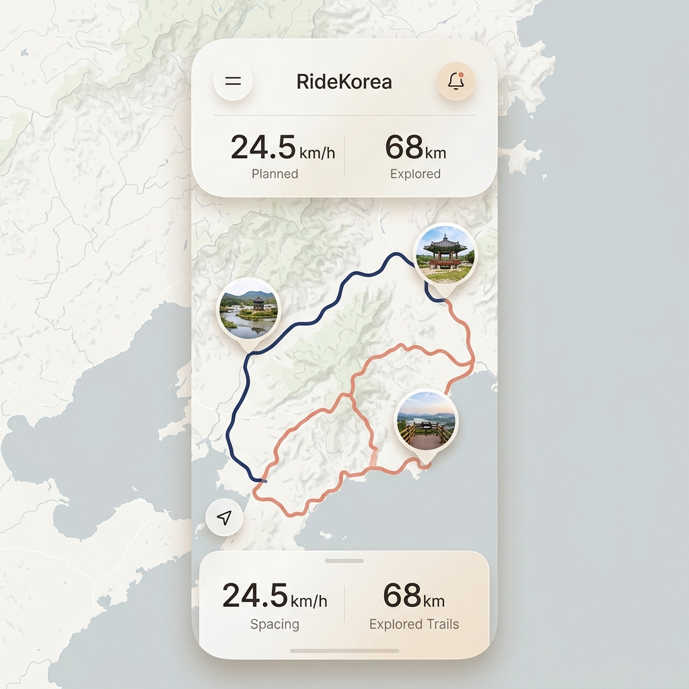
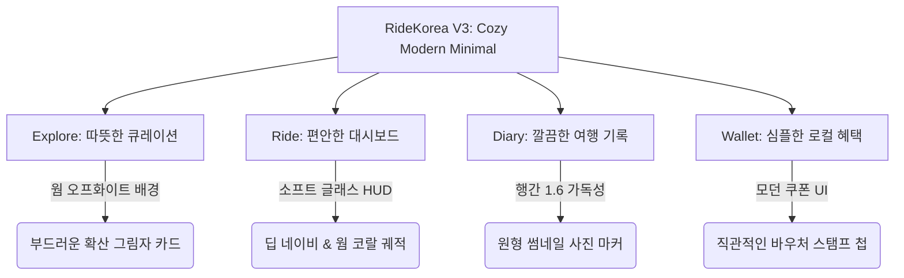

# 11. RideKorea V3: Cozy Modern Minimal (모던하고 편안한 따뜻한 UX 고도화 가이드)

## 📌 1. 기획 철학 및 방향성

본 문서는 클로드 버전(`RideKorea_b`)이 구현한 **최고의 장점(직관적인 4대 탭 구조, 간결하고 정돈된 화면 레이아웃, 안정적인 모듈 아키텍처)**을 100% 계승하면서, 사용자에게 **[모던하고 편안하되, 조금 더 따뜻한 감성]**을 전달하기 위한 UI/UX 고도화 명세입니다.

### 🚫 배제한 요소 (Over-engineering & Gimmicks 제고)
과도하게 인위적이거나 사용성을 해칠 수 있는 연출은 과감히 제외했습니다.
* ❌ 전통 마패/상평통보 모티브 및 손글씨 폴라로이드 사진 프레임 (직관성 저하 방지)
* ❌ 글래스 대시보드 위의 빗방울 물맺힘 애니메이션 (배터리 소모 및 지도 가독성 저하 방지)
* ❌ 눈이 시린 네온 형광(Electric Cyan / Neon Pink) 궤적 (자연 풍경과의 조화 저해 방지)

### 🌿 추구하는 가치: "Cozy Modern Minimal"
자전거를 타고 한국을 여행하는 '사사키'에게 필요한 것은 화려한 장식이 아닙니다. **눈이 편안한 따뜻한 색감**, **콘텐츠에 집중할 수 있는 여유로운 여백**, 그리고 **부드러운 글래스 질감과 가독성 높은 텍스트**가 어우러진 **편안한 프리미엄 UX**입니다.

---

## 📸 2. 시각적 UI 시안 및 4대 디자인 혁신



### ❶ 색감 (Warm & Cozy Color Palette)
* **배경색의 온도 상승**: 차갑고 병원 같은 파란 계열 화이트(`#FFFFFF`, `#F1F5F9`) 대신, 눈이 편안하고 종이의 온기가 느껴지는 **웜 오프화이트/샌드 (Warm Off-White, `#FDFBF7`)** 및 **소프트 오트밀(Oatmeal, `#F5F2EB`)** 톤을 배경 및 카드 표면색으로 채택합니다.
* **자연 친화적 궤적 배색**: 
  * 기본 정식 경로(Planned): 차분하고 신뢰감을 주는 **딥 네이비 / K-Indigo (`#1E3A8A`)**
  * 사사키의 이탈 탐험 경로(Deviated): 자연 풍경 위에서 튀지 않으면서도 따뜻한 생동감을 주는 **웜 테라코타 코랄 (`#E17055`)** 또는 **선셋 앰버 (`#D97706`)**

### ❷ 화면 프레임 배치와 구성 (Layout & Breathing Room)
* **여유로운 여백 (Breathing Room)**: 컴포넌트 간 간격(Padding/Margin)을 기존 클로드 버전보다 15~20% 확대(`space.lg: 18px`, `space.xl: 28px`)하여 장시간 라이딩 중에도 화면이 답답해 보이지 않도록 구성합니다.
* **부드러운 카드 라운딩과 그림자**: 곡률을 모던하게 다듬은 라운딩(`radius.card: 20px`)과, 짙은 검은색 그림자 대신 옅고 넓게 퍼지는 **확산 그림자(Soft Diffused Shadow, `rgba(15, 23, 42, 0.06)`)**를 적용하여 콘텐츠가 지도 위에 가볍고 부드럽게 부유하는 느낌을 줍니다.
* **정돈된 마커**: 지도 위의 지점 표시(POI, 사진 스팟)는 복잡한 프레임 대신, 흰색 보더가 둘러싸인 **깔끔한 원형 프로필/썸네일 핀(Clean Circular Pins)**으로 통합합니다.

### ❸ 텍스트 질감 및 타이포그래피 (Typography & Texture)
* **고가독성 모던 폰트 유지**: 주행 중 흔들리는 자전거 위에서 0.1초 만에 숫자를 읽을 수 있도록 기하학적 산스세리프(Inter / Outfit)의 장점을 유지합니다.
* **행간과 톤 조율을 통한 편안함**: 
  * 제목과 기행문 텍스트의 행간(Line-height)을 `1.6`으로 넉넉하게 설정하여 글이 숨을 쉬듯 편안하게 읽히도록 합니다.
  * 보조 텍스트 및 라벨에는 차가운 회색 대신 따뜻한 온기가 도는 웜 슬레이트(`Warm Slate, #64748B`)를 적용해 시각적 피로도를 낮춥니다.

### ❹ 글래스모피즘 HUD의 진화 (Soft Frosted Glass)
* 상·하단 대시보드는 지도 풍경을 해치지 않으면서 정보 가독성을 지키는 **소프트 프로스테드 글래스 (Frosted Glass, `blur: 24px`, 배경 투명도 `85%`)**를 적용합니다. 라이트 모드에서는 따뜻한 오프화이트 반투명(`rgba(253, 251, 247, 0.85)`), 다크 모드에서는 차분한 딥 슬레이트 반투명을 띠어 고급스러움을 더합니다.

---

## 🎯 3. 4대 탭별 개선 명세



### ❶ Explore (탐색) 탭
* **상단 헤더**: 여유로운 상단 여백과 함께 브랜딩 로고가 따뜻한 네이비 톤으로 자리 잡습니다.
* **루트 리스트 (`RouteCard.tsx`)**: 오트밀 톤 배경 위에 카드가 부드럽게 안착하며, 태그 뱃지들은 웜 코랄과 소프트 블루의 파스텔톤으로 배색되어 눈이 편안합니다.

### ❷ Ride (주행) 탭
* **상단 주행 정보 HUD (`GlassDashboard.tsx`)**: 투명도 85%의 따뜻한 반투명 글래스 패널 안에 속도(`km/h`), 주행거리(`km`), 시간(`MM:SS`)이 균형 잡힌 여백으로 배치됩니다.
* **하단 컨트롤 버튼**: 시작/일시정지 버튼은 터치 오류가 없도록 최소 `64px` 이상의 넉넉한 둥근 알약형(Pill) 구조를 가지며, 메인 액션은 신뢰감 있는 K-Indigo 컬러로 마감합니다.

### ❸ Diary (기록) 탭
* **타임라인 피드**: 주행 후 생성되는 기록은 모던한 블로그 매거진 형태로 깔끔하게 떨어집니다. 
* **지도 조각과 원형 핀**: 코스 지도 위에는 사사키가 사진을 찍은 지점들이 심플하고 직관적인 원형 썸네일 핀으로 표시되며, 클릭 시 하단 반투명 시트로 사진과 감상평이 부드럽게 올라옵니다.

### ❹ Wallet (지갑) 탭
* 복잡한 전통 장식 대신, 모던 멤버십 앱(스타벅스, 현대카드 등)처럼 정돈되고 세련된 바우처 첩 형태로 제공됩니다. 지역 상점 방문 시 부드러운 스탬프 획득 애니메이션으로 기분 좋은 성취감을 제공합니다.

---

## 💻 4. 프론트엔드 구현 코딩 가이드 (`src/theme/theme.ts` 고도화)

클로드 버전의 기존 `src/theme/theme.ts`를 아래와 같이 **"Cozy Modern Minimal"** 팔레트와 간격 상수로 교체하여 적용합니다.

```typescript
// src/theme/theme.ts (Cozy Modern Minimal 명세)
export const colors = {
  // Brand & Tracks
  primary: "#1E3A8A",       // K-Indigo — 신뢰감 있는 브랜드 메인 및 기본 궤적
  exploration: "#E17055",   // Warm Terracotta Coral — 따뜻하고 생동감 있는 탐험 이탈 궤적
  accent: "#0EA5E9",        // Soft Sky Blue

  // Warm Surfaces (눈이 편안한 온기 있는 배경)
  bg: "#FDFBF7",            // Warm Off-White (메인 배경)
  surface: "#FFFFFF",       // 카드 표면
  surfaceMuted: "#F5F2EB",  // Soft Oatmeal (보조 패널 배경)
  
  // Frosted Glass Panels
  glassLight: "rgba(253, 251, 247, 0.86)", // 라이트 모드 글래스 HUD
  glassDark: "rgba(15, 23, 42, 0.75)",     // 다크 모드 글래스 HUD
  borderGlass: "rgba(226, 232, 240, 0.6)", // 부드러운 패널 테두리

  // Typography & Text
  text: "#0F172A",          // Deep Slate Black
  textMuted: "#64748B",     // Warm Slate Grey (눈이 편안한 보조 텍스트)
  textOnPrimary: "#FFFFFF",
  
  border: "#E2E8F0",
  success: "#16A34A",
  danger: "#DC2626",
} as const;

/** 여유롭고 편안한 호흡을 위한 확장 스페이스 스케일 */
export const space = {
  xs: 4,
  sm: 8,
  md: 12,
  lg: 18,     // 기존 16px -> 18px (편안한 패딩)
  xl: 28,     // 기존 24px -> 28px (넉넉한 카드 간격)
  xxl: 36,
  touch: 64,  // 장갑 낀 손을 고려한 안정적인 터치 타겟 (기존 60 -> 64px)
} as const;

export const radius = {
  sm: 10,
  card: 20,   // 기존 16px -> 20px (더욱 부드러운 모던 곡률)
  pill: 999,
} as const;

export const shadows = {
  // 짙은 그림자 대신 부드럽게 퍼지는 모던 확산 그림자
  soft: {
    shadowColor: "#0F172A",
    shadowOffset: { width: 0, height: 6 },
    shadowOpacity: 0.06,
    shadowRadius: 16,
    elevation: 3,
  },
} as const;
```

---

## 🏁 5. 결론

**RideKorea V3: Cozy Modern Minimal** 가이드는 불필요한 기교와 인위적인 장식을 모두 걷어내고, 클로드 버전이 가진 **최고의 모듈 아키텍처와 사용성** 위에 **[따뜻한 색감, 여유로운 여백, 눈이 편안한 텍스트 질감]**만을 정제하여 담아냈습니다. 
이 명세서를 통해 사사키는 이국땅 대한민국에서 가장 편안하고 따뜻한 그늘 같은 자전거 여행 가이드를 경험하게 될 것입니다!
